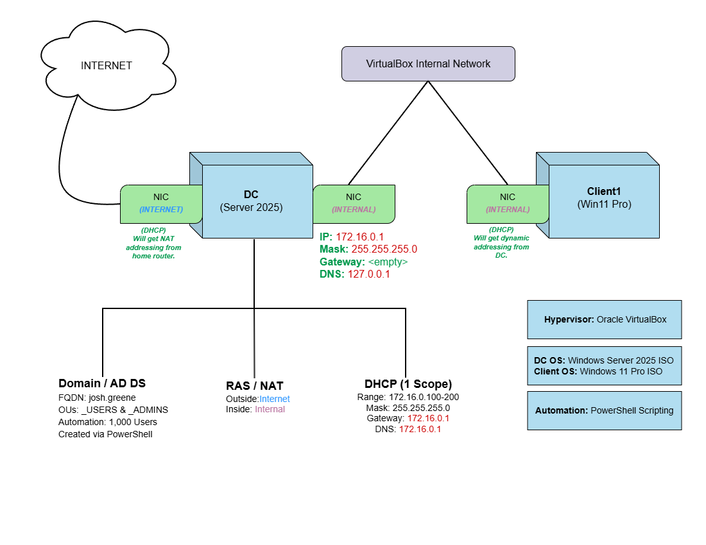
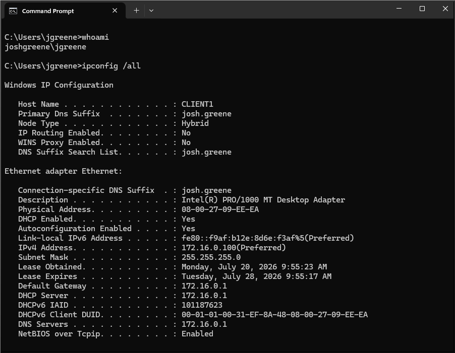
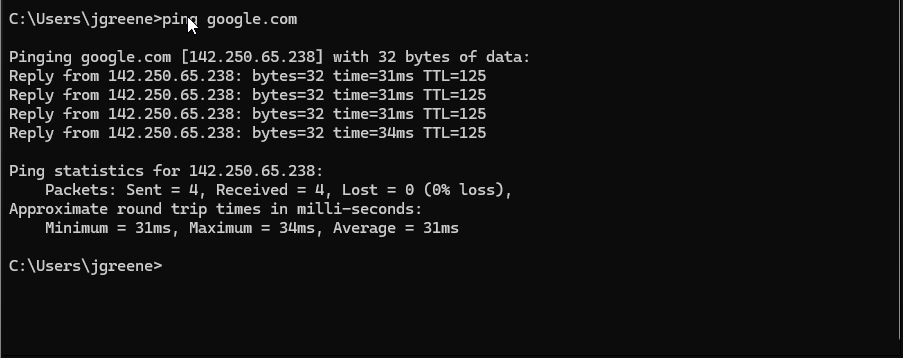
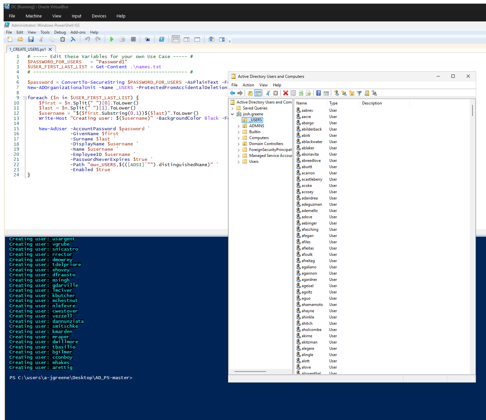
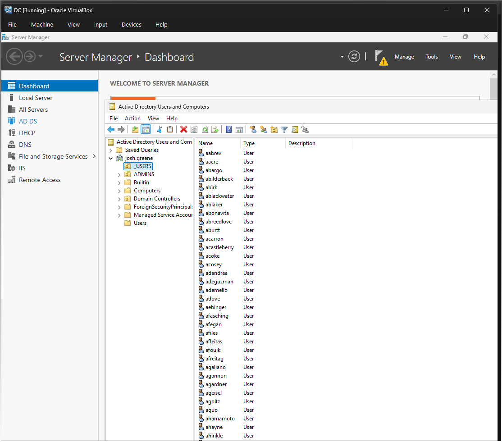
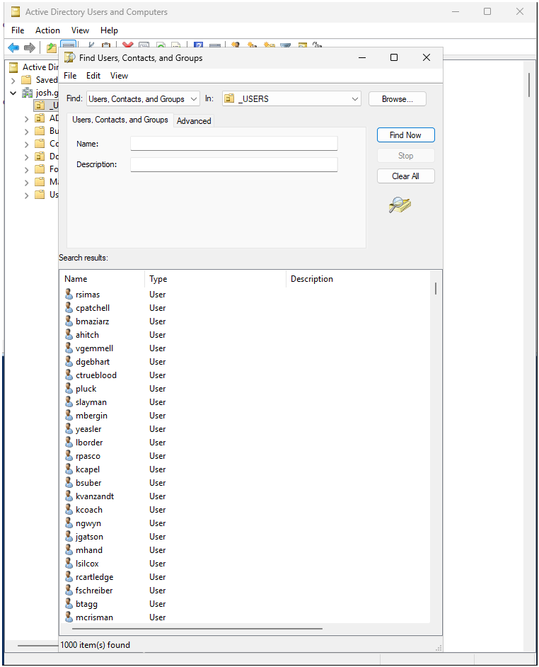
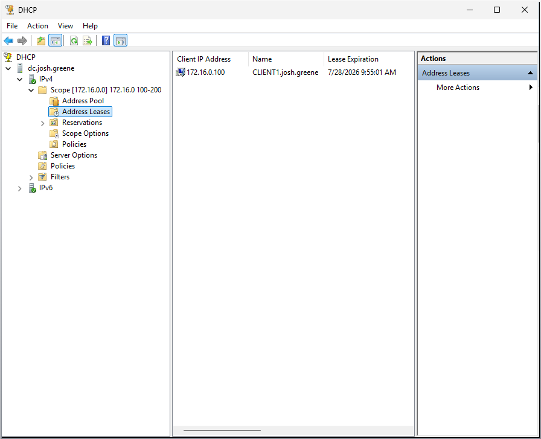

# Enterprise Active Directory & PowerShell Automation Lab

An end-to-end enterprise Active Directory infrastructure deployed within a dual-homed, isolated virtual laboratory environment. This project demonstrates core systems administration competencies including domain topology design, dynamic network addressing (DHCP), WAN routing via RAS/NAT, structured Organizational Unit (OU) policy layout, and bulk user provisioning using PowerShell.

---

## 📌 Key Highlights

* **Automated Provisioning:** Programmatically generated **1,000 Active Directory user accounts** complete with standardized UPNs and attributes in under two minutes via PowerShell.
* **Network Isolation & WAN Routing:** Configured dual-NIC Routing and Remote Access Services (RRAS) with NAT, enabling secure internet access for isolated private internal networks (`172.16.0.0/24`).
* **Identity Management:** Applied the Principle of Least Privilege by separating administrative roles (`_ADMINS`) from standard domain accounts (`_USERS`).

---

## 📋 Table of Contents

- [Network Architecture](#network-architecture)
- [Technical Stack & Infrastructure](#technical-stack-and-infrastructure)
- [Network & IP Configuration](#network-and-ip-configuration)
- [Core Implementations](#core-implementations)
- [Verification & Evidence](#verification-and-evidence)
- [Troubleshooting & Engineering Log](#troubleshooting-and-engineering-log)
- [Automation Scripts](#automation-scripts)

---

## 📐 Network Architecture

---

## 🛠️ Technical Stack & Infrastructure

* **Hypervisor:** Oracle VirtualBox
* **Domain Controller (DC):** Windows Server 2025 ISO
* **Client Workstation:** Windows 11 Pro ISO
* **Core Services:** Active Directory Domain Services (AD DS), DHCP, Routing and Remote Access Services (RRAS / NAT), DNS
* **Automation & Tools:** PowerShell ISE, Command Prompt, Draw.io

---

## 🌐 Network & IP Configuration

| Configuration Parameter | Domain Controller (`DC`) | Client Workstation (`CLIENT1`) |
| :--- | :--- | :--- |
| **Server Role** | AD DS, DNS, DHCP, NAT Gateway | Joined Domain Workstation |
| **Domain FQDN** | `josh.greene` | `josh.greene` |
| **Internal Interface IP** | `172.16.0.1 /24` | `172.16.0.100 /24` *(Dynamic DHCP)* |
| **Subnet Mask** | `255.255.255.0` | `255.255.255.0` |
| **Default Gateway** | *Unassigned (Dual-homed)* | `172.16.0.1` |
| **Preferred DNS** | `127.0.0.1` *(Loopback)* | `172.16.0.1` |
| **External Interface IP** | DHCP *(NAT to Physical Network)* | *N/A (Routed via DC Gateway)* |

---

## ⚡ Core Implementations

### 1. Active Directory Domain Services (AD DS) & OU Hierarchy
* Promoted server to primary Domain Controller for the `josh.greene` forest.
* Architected a logical OU hierarchy to support scalable access control and Group Policy Object (GPO) deployment:
  * `_ADMINS` — Dedicated container for privileged administrative user accounts (e.g., `a-jgreene`).
  * `_USERS` — Dedicated container for enterprise end-user objects.

### 2. Network Infrastructure Services (DHCP & RAS/NAT)
* Established a DHCP scope (`172.16.0.100` – `172.16.0.200`) configured with Scope Options for Router (`172.16.0.1`) and DNS Server (`172.16.0.1`).
* Deployed and configured Routing and Remote Access Services (RRAS) on the DC with Network Address Translation (NAT) enabled on the external NIC, allowing private-subnet internal clients to route WAN requests through the DC safely.

### 3. Bulk User Provisioning via PowerShell Automation
* Configured and executed a PowerShell automation script (`Generate-ADUsers.ps1`) to parse raw input data (`names.txt`).
* Implemented structured loop logic to automate account generation, automatically assigning User Principal Names (UPNs), standardized display names, mandatory pre-set passwords, and target OU paths (`_USERS`).

---

## 📸 Verification & Evidence

### 1. Domain Join & IP Configuration
Client workstation (`CLIENT1`) successfully joined to `josh.greene`, demonstrating proper DHCP dynamic address assignment (`172.16.0.100`) and domain suffix verification.

### 2. Outbound Network Routing (WAN) Verification
Verification of active ICMP reachability to external WAN targets (`google.com`) routed through the Domain Controller's RRAS/NAT interface.

### 3. Automated PowerShell Execution
Live execution of the custom user creation script generating domain user accounts while dynamically binding properties into Active Directory.

### 4. Active Directory OU & User Audit
Confirmation of populated accounts within the `_USERS` Organizational Unit, including search verification confirming exactly 1,000 active domain accounts.

| Active Directory Users & Computers | Search Verification (1,000 Accounts) |
| :---: | :---: |
|  |  |

### 5. Active DHCP Address Leases
DHCP Management Console verifying active scope leasing and successful reservation mapping for `CLIENT1.josh.greene`.

---

## 🔍 Troubleshooting & Engineering Log

> [!NOTE]
> **Issue 1: PowerShell Script Execution Blocked**  
> **Error:** Running the bulk creation script returned `File [...] cannot be loaded because running scripts is disabled on this system.`  
> **Resolution:** Adjusted the execution policy in an elevated PowerShell instance via `Set-ExecutionPolicy Unrestricted` to allow unsigned deployment scripts in the local test environment (`ps-script1.png`).

> [!NOTE]
> **Issue 2: Stale DHCP Lease Timestamps**  
> **Error:** Client machine reported out-of-sync DHCP lease timestamps (`1890`) after initial domain integration due to system clock drift prior to Kerberos/NTP synchronization.  
> **Resolution:** Deleted the active lease record on the Domain Controller (`Address Leases`), synchronized virtual machine clocks, and ran an `ipconfig /release` / `ipconfig /renew` cycle on `CLIENT1` to establish clean, synchronized lease timestamps (`client-cmd.png`).

---

## 📜 Automation Scripts

All deployment scripts and datasets are stored in the [`/scripts`](./scripts) folder:
* [`Generate-ADUsers.ps1`](./scripts/Generate-ADUsers.ps1) — PowerShell deployment script for bulk account generation.
* [`names.txt`](./scripts/names.txt) — Source dataset containing 1,000 user records.
